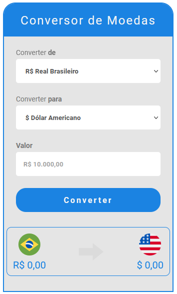
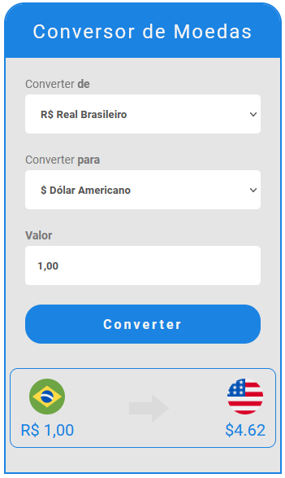
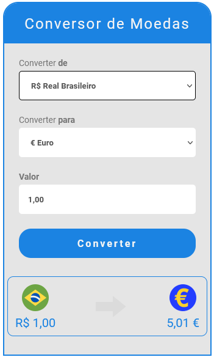
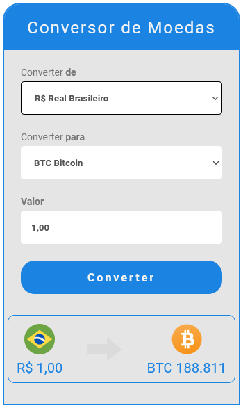
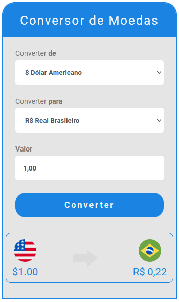
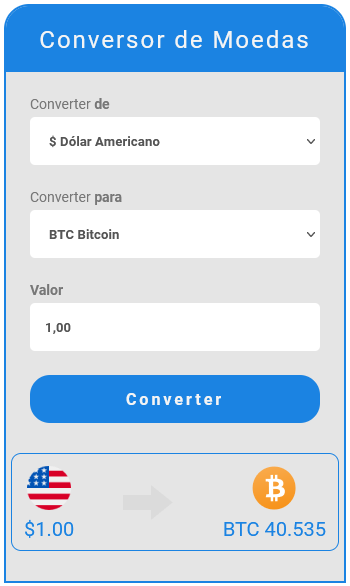

<h1 align="center" style="max-width: 250px; margin: 30px 0;">
    Conversor de Moedas :currency_exchange:
</h1>
<a href="https://renatolira-conversormoedas.netlify.app/"></img></a>
 
<a href="https://renatolira-conversormoedas.netlify.app/">Aplicativo ONLINE, Clique para acessar!</a> 

<h4 align="center">
  Uma aplicação simples desenvolvida com HTML + CSS + JavaScript, consumindo a API de cotação de moedas da <a href="https://docs.awesomeapi.com.br/api-de-moedas">AwesomeAPI</a>.
</h4>
 

## :sunny: Resultado

  

      
      
      
      
      
      

---
[vc]: https://code.visualstudio.com/
